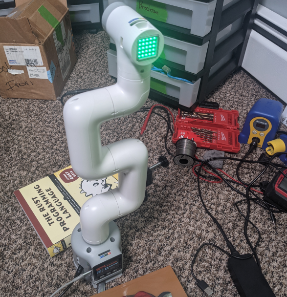

# myCobot on ROS 2

[](https://github.com/tylerjw/mycobot/actions/workflows/ci.yaml?query=branch%3Amain)
[](https://tylerjw.testspace.com/spaces/163818?utm_campaign=badge&utm_medium=referral&utm_source=test "Test Cases")
[](https://codecov.io/gh/tylerjw/mycobot)
[](https://github.com/tylerjw/mycobot/blob/main/LICENSE)
[](#)
[](#)
[](#)



* mycobot - C++ interface to MyCobot
* mycobot_280_description - Configs and launch files for running MoveIt with MyCobot 280
* mycobot_hardware_interface - ros2_control hardware interface for mycobot

```bash
ros2 launch mycobot_280_description move_group.launch.py
```

## References

* [pymocobot](https://github.com/elephantrobotics/pymycobot) - Python interface to MyCobot
* [mycobot_ros](https://github.com/elephantrobotics/mycobot_ros) - ROS 1 MyCobot Packages
* [myCobot Docs](https://docs.elephantrobotics.com/docs/myCobot-en/) - myCobot-Gitbook
* [Purchase a myCobot](https://www.elephantrobotics.com/en/mycobot-en/) - Elephant Robotics
